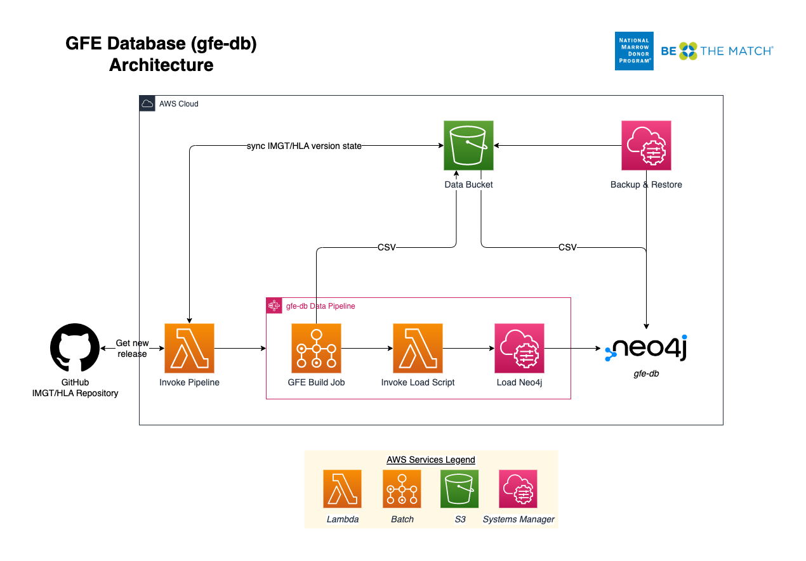

# gfe-db

Graph database representing IPD-IMGT/HLA sequence data as GFE.

<!-- Need to update image -->
<!--  -->

## Table of Contents
- [gfe-db](#gfe-db)
  * [Table of Contents](#table-of-contents)
  * [Project Structure](#project-structure)
  * [Description](#description)
  * [Architecture](#architecture)
    + [Base Infrastructure](#base-infrastructure)
      - [Access Services](#access-services)
    + [Database](#database)
    + [Data Pipeline](#data-pipeline)
  * [Prerequisites](#prerequisites)
    + [Libraries](#libraries)
    + [Resources](#resources)
  * [Quick Start](#quick-start)
    + [Using external VPC and public subnet](#using-external-vpc-and-public-subnet)
    + [Creating a new VPC and public subnet](#creating-a-new-vpc-and-public-subnet)
    + [Using external VPC and private subnet](#using-external-vpc-and-private-subnet)
    + [Creating a new VPC and private subnet](#creating-a-new-vpc-and-private-subnet)
  * [Application Environment](#application-environment)
    + [AWS Credentials](#aws-credentials)
    + [Deployment Configurations](#deployment-configurations)
      - [Shell Variables](#shell-variables)
  * [Makefile Usage](#makefile-usage)
    + [Makefile Command Reference](#makefile-command-reference)
    + [Managing Configuration](#managing-configuration)
  * [Database Configuration](#database-configuration)
    + [Neo4j](#neo4j)
    + [Shell Scripts](#shell-scripts)
    + [Cypher Scripts](#cypher-scripts)
    + [SSL Policy](#ssl-policy)
  * [Data Pipeline Config](#data-pipeline-config)
    + [Invocation Input](#invocation-input)
    + [IMGT/HLA Release Versions State](#imgt-hla-release-versions-state)
  * [Loading Neo4j](#loading-neo4j)
  * [Clean Up](#clean-up)
  * [Backup & Restore](#backup---restore)
    + [Backups](#backups)
    + [Restore](#restore)
  * [Local Development](#local-development)
    + [Creating a Python Virtual Environment](#creating-a-python-virtual-environment)
  * [Documentation](#documentation)
    + [Editing and Building the Documentation](#editing-and-building-the-documentation)
  * [Troubleshooting](#troubleshooting)
  * [Authors](#authors)
  * [References & Links](#references---links)

<small><i><a href='http://ecotrust-canada.github.io/markdown-toc/'>Table of contents generated with markdown-toc</a></i></small>

## Project Structure
```bash
.
├── LICENSE
├── CONTRIBUTING.md
├── Makefile                                        # Use the root Makefile to deploy, delete and manage resources and configuration
├── README.md
├── docs                                            # Sphinx documentation
├── (<stage>-gfe-db-<region>-neo4j-key.pem)         # EC2 key pair for SSH access to Neo4j server, created on deployment
├── requirements-dev.txt                                # Python requirements for local development
├── requirements-docs.txt                                    # Python requirements for documentation
└── gfe-db
    # Database layer
    ├── database                                    # Neo4j database server, configuration and automation
    │   ├── Makefile
    │   ├── amazon-cloudwatch-agent
    │   │   └── amazon-cloudwatch-agent.json        # Sends EC2 logs to CloudWatch Logs for monitoring
    │   ├── neo4j
    │   │   ├── cypher                              # Cypher scripts for initialization and loading
    │   │   └── neo4j.template                      # Neo4j server configuration file
    │   ├── scripts                                 # Shell scripts for automation, loading, backup & restore
    │   └── template.yaml
    # Base Infrastructure layer
    ├── infrastructure
    │   ├── Makefile
    │   ├── access-services
    │   │   ├── bastion-server                      # bastion server for private deployments
    │   │   │   ├── Makefile
    │   │   │   └── template.yaml
    │   │   └── nat-gateway                         # NAT Gateway for private deployments
    │   │       ├── Makefile
    │   │       └── template.yaml
    │   ├── change-batch.json
    │   └── template.yaml
    # Data Pipeline layer
    └── pipeline                                     # Data pipeline including Batch job, Lambda functions & state machine
        ├── Makefile
        ├── config                                   # JSON files for storing app state
        │   ├── IMGTHLA-repository-state.json        # IMGT/HLA release version state
        │   └── pipeline-input.json                  # Default pipeline input parameters for scheduled invocations
        ├── functions
        │   ├── environment.json                     # Lambda configurations
        │   ├── invoke_load_script                   # Invokes Run Command to download and execute a schell script on EC2
        │   └── invoke_pipeline                      # Invokes the state machine
        ├── jobs                                     # Build job, triggered when a new IMGT/HLA version is released
        │   ├── Makefile
        │   └── build
        ├── statemachines                            # State machine for loading data into Neo4j
        └── template.yaml
```

## Description
`gfe-db` is an implementation of the paper [A Gene Feature Enumeration Approach For Describing HLA Allele Polymorphism](https://www.ncbi.nlm.nih.gov/pmc/articles/PMC4674356/) to represent IPD-IMGT/HLA sequence data as GFE nodes and relationships using a Neo4j graph database. This application deploys and configures AWS resources for the GFE database and an automated data pipeline for updates.

<!-- TODO update schema image -->
<br>
<p align="center">
  
</p>

## Architecture
<br>
<p align="center">
  
</p>

`gfe-db` architecture is organized by 3 layers each with its own Makefile:
1) Base Infrastructure 
2) Database 
3) Data pipeline
 
This allows the database and pipeline layers to be decoupled from each other and deployed or destroyed independently without affecting the other. Common configuration parameters are shared between resources using environment variables, JSON files, AWS SSM Parameter Store and Secrets Manager.

### Base Infrastructure
The base infrastructure layer deploys a VPC and subnets, S3 bucket and common SSM parameters and secrets for the other services to use. For private deployments this layer manages VPC endpoints, NAT Gateway and a bastion server. For public deployments it manages Elastic IPs and DNS routing for Neo4j.

#### Access Services
Optional resources for private deployments (`USE_PRIVATE_SUBNET=true`) include a NAT Gateway and bastion server. The NAT Gateway provides internet access to the private subnet for initializing Neo4j. The bastion server allows secure access to the Neo4j server and Neo4j Browser. These resources are deployed using CloudFormation and managed using Makefile targets. It is possible to remove them after deployment to save costs and re-deploy them later if needed.

### Database
The database layer deploys Neo4j to an EC2 instance running the Ubuntu 20.04 LTS base image in a public or private subnet. Public deployments update the existing A record of a Route53 domain and hosted zone so that SSL can be used to connect to Neo4j browser. During database deployment the SSL certificate is created (public deployments) and Cypher queries are run to create constraints and indexes, which help speed up loading and ensure data integrity. Neo4j is ready to be accessed through a browser once the instance has booted sucessfully. For private deployments, the bastion server must be used to connect to Neo4j Browser.

During loading, a Lambda function calls the SSM Run Command API to execute bash scripts on the database instance. These scripts communicate with the Step Functions API to retrieve the job parameters, fetch the CSVs from S3 and populate the graph in Neo4j.

It is also possible to backup & restore gfe-db to and from S3 using zip archives. The server backs itself up automatically once a day.

### Data Pipeline
The data pipeline layer automates integration of newly released IMGT/HLA data into the gfe-db graph model using a scheduled Lambda which watches the source data repository and invokes the build and load processes when it detects a new IMGT/HLA version in the upstream repository. The pipeline consists of a Step Functions state machine which orchestrates backup, validation and the build and load stages. The build process employs a Batch job to generate an intermediate set of CSV files from IMGT/HLA data. The load process leverages SSM Run Command to copy the CSV files to the Neo4j server and execute Cypher statements directly on the server. When loading the full dataset of 35,000+ alleles, the build step will generally take around 15 minutes, however the load step can take an hour or more. It is possible to fully restore gfe-db from an existing backup if one is available.

## Prerequisites

### Libraries
Please refer to the respective documentation for specific installation instructions.
* GNU Make 3.81
* coreutils
* AWS CLI
* SAM CLI
* Docker
* jq
* Python 3.10+

### Resources
The following resources are required to deploy the application depending on the chosen configuration.
* Route53 domain, hosted zone, and A record (for public deployments)
* VPC & Public Subnet (if using external VPC)
* VPC, Public Subnet & Private Subnet (if using external VPC and private subnet)

## Quick Start
These list outline the basic steps for deployments. For more details please see the following sections.

### Using external VPC and public subnet
1. Retrieve the VPC ID and public subnet ID from the AWS console or using the AWS CLI.
2. Purchase or designate a domain in Route53 and create a hosted zone with an A record for the subdomain. You can use `0.0.0.0` for the A record because it will be updated later by the deployment script.
3. [Install prerequisites](#Prerequisites).
4. [Set environment variables](#environment) including the ones from the previous steps. You must store these in a file named `.env.<stage>`, for example `.env.dev` or `.env.prod`:
    - CREATE_VPC=false
    - USE_PRIVATE_SUBNET=false
    - VPC_ID=<vpc_id>
    - PUBLIC_SUBNET_ID=<public_subnet_id>
    - HOSTED_ZONE_ID=<hosted_zone_id>
    - HOST_DOMAIN=<fully_qualified_domain_name>
    - SUBDOMAIN=<subdomain>
    - UBUNTU_AMI_ID=<ami_id>
5. Check the [config JSONs](#data-pipeline-config) (parameters and state) and edit the values as desired.
6. Run `STAGE=<stage> make deploy` to deploy the stacks to AWS.
7. Run `STAGE=<stage> make database.load.run releases=<version>` to load Neo4j, or `STAGE=<stage> make database.load.run releases=<version> limit=<limit>` to run with a limited number of alleles.
8. Run `STAGE=<stage> make database.get.credentials` to get the username and password for Neo4j.
9. Run `STAGE=<stage> make database.ui.connect` to get the URL for Neo4j and navigate to the Neo4j browser at the subdomain and host domain, for example `https://<SUBDOMAIN>.<HOST_DOMAIN>:7473/browser/` for public deployments or `http://localhost:7474/browser/` for private deployments.

### Creating a new VPC and public subnet
1. Purchase or designate a domain in Route53 and create a hosted zone with an A record for the subdomain. You can use `0.0.0.0` for the A record because it will be updated later by the deployment script.
2. [Install prerequisites](#Prerequisites).
3. [Set environment variables](#environment) including the ones from the previous steps. You must store these in a file named `.env.<stage>`, for example `.env.dev` or `.env.prod`:
    - CREATE_VPC=true
    - USE_PRIVATE_SUBNET=false
    - HOSTED_ZONE_ID=<hosted_zone_id>
    - HOST_DOMAIN=<fully_qualified_domain_name>
    - SUBDOMAIN=<subdomain>
    - UBUNTU_AMI_ID=<ami_id>
4. Check the [config JSONs](#data-pipeline-config) (parameters and state) and edit the values as desired.
5. Run `STAGE=<stage> make deploy` to deploy the stacks to AWS.
6. Run `STAGE=<stage> make database.load.run releases=<version>` to load Neo4j, or `STAGE=<stage> make database.load.run releases=<version> limit=<limit>` to run with a limited number of alleles.
7. Run `STAGE=<stage> make database.get-credentials` to get the username and password for Neo4j.
8. Run `STAGE=<stage> make database.ui.connect` to get the URL for Neo4j and navigate to the Neo4j browser at the subdomain and host domain, for example `https://<SUBDOMAIN>.<HOST_DOMAIN>:7473/browser/` for public deployments or `http://localhost:7474/browser/` for private deployments.

### Using external VPC and private subnet
1. Retrieve the VPC ID and public and private subnet IDs from the AWS console or using the AWS CLI.
2. [Install prerequisites](#Prerequisites).
3. [Set environment variables](#environment) including the ones from the previous steps. You must store these in a file named `.env.<stage>`, for example `.env.dev` or `.env.prod`:
    - CREATE_VPC=false
    - USE_PRIVATE_SUBNET=true
    - VPC_ID=<vpc_id>
    - PUBLIC_SUBNET_ID=<public_subnet_id>
    - PRIVATE_SUBNET_ID=<private_subnet_id>
    - UBUNTU_AMI_ID=<ami_id>
4. Set the following environment variables to specify access services configuration:
    - DEPLOY_NAT_GATEWAY=true/false
    - EXTERNAL_NAT_GATEWAY_ID=<nat_gateway_id> (if DEPLOY_NAT_GATEWAY=false)
    - DEPLOY_BASTION_SERVER=true/false
    - ADMIN_IP=0.0.0.0/0 (if DEPLOY_BASTION_SERVER=true)
    - CREATE_SSM_VPC_ENDPOINT=true/false
    - SSM_VPC_ENDPOINT_ID=<ssm_vpc_endpoint_id> (if CREATE_SSM_VPC_ENDPOINT=false)
    - CREATE_SECRETSMANAGER_VPC_ENDPOINT=true/false
    - SECRETSMANAGER_VPC_ENDPOINT_ID=<secretsmanager_vpc_endpoint_id> (if CREATE_SECRETSMANAGER_VPC_ENDPOINT=false)
    - CREATE_S3_VPC_ENDPOINT=true/false
    - S3_VPC_ENDPOINT_ID=<s3_vpc_endpoint_id> (if CREATE_S3_VPC_ENDPOINT=false)
5. Check the [config JSONs](#data-pipeline-config) (parameters and state) and edit the values as desired.
6. Run `STAGE=<stage> make deploy` to deploy the stacks to AWS.
7. Run `STAGE=<stage> make database.load.run releases=<version>` to load Neo4j, or `STAGE=<stage> make database.load.run releases=<version> limit=<limit>` to run with a limited number of alleles.
8. Run `STAGE=<stage> make database.ui.connect` to get the URL for Neo4j and navigate to the Neo4j browser at the subdomain and host domain, for example `https://<SUBDOMAIN>.<HOST_DOMAIN>:7473/browser/` for public deployments or `http://localhost:7474/browser/` for private deployments.

### Creating a new VPC and private subnet
1. [Install prerequisites](#Prerequisites).
2. [Set environment variables](#environment) including the ones from the previous steps. You must store these in a file named `.env.<stage>`, for example `.env.dev` or `.env.prod`:
    - CREATE_VPC=true
    - USE_PRIVATE_SUBNET=true
    - UBUNTU_AMI_ID=<ami_id>
3. Set the following environment variables to specify access services configuration:
    - DEPLOY_NAT_GATEWAY=true
    - DEPLOY_BASTION_SERVER=true/false
    - ADMIN_IP=0.0.0.0/0 (if DEPLOY_BASTION_SERVER=true)
    - CREATE_SSM_VPC_ENDPOINT=true
    - CREATE_SECRETSMANAGER_VPC_ENDPOINT=true
    - CREATE_S3_VPC_ENDPOINT=true
4. Check the [config JSONs](#data-pipeline-config) (parameters and state) and edit the values as desired.
5. Run `STAGE=<stage> make deploy` to deploy the stacks to AWS.
6. Run `STAGE=<stage> make database.load.run releases=<version>` to load Neo4j, or `STAGE=<stage> make database.load.run releases=<version> limit=<limit>` to run with a limited number of alleles.
7. Run `STAGE=<stage> make database.ui.connect` to get the URL for Neo4j and navigate to the Neo4j browser at the subdomain and host domain, for example `https://<SUBDOMAIN>.<HOST_DOMAIN>:7473/browser/` for public deployments or `http://localhost:7474/browser/` for private deployments.

## Application Environment

### AWS Credentials
Valid AWS credentials must be available to AWS CLI and SAM CLI. The easiest way to do this is with the following steps.
1. Run `aws configure` and follow the prompts, or copy/paste them into `~/.aws/credentials`:
```bash
# ~/.aws/credentials
[123456789101_AdministratorAccess]
aws_access_key_id=********************
aws_secret_access_key=********************
aws_session_token=********************
```

2. Export the `AWS_PROFILE` variable for the chosen profile to the shell environment:
```bash
export AWS_PROFILE=123456789101_AdministratorAccess
```

3. Run `aws configure` to set the default region, or copy/paste it into `~/.aws/config`. The region must be the same as the one specified in `.env.<stage>` and the output should be `json`:
```bash
# ~/.aws/config
[profile 123456789101_AdministratorAccess]
region = <region>
output = json
```

For more information visit the documentation page:
[Configuration and credential file settings](https://docs.aws.amazon.com/cli/latest/userguide/cli-configure-files.html)

### Deployment Configurations
It is possible to deploy gfe-db within it's own VPC, or to connect it to an external VPC by specifying `CREATE_VPC=true/false`. Public or private deployments are specified using `USE_PRIVATE_SUBNET=true/false`. If deploying to an external VPC, you must specify the VPC ID and public subnet ID using `VPC_ID` and `PUBLIC_SUBNET_ID`. If deploying to a new VPC, you must specify the hosted zone ID, domain and subdomain using `HOSTED_ZONE_ID`, `HOST_DOMAIN` and `SUBDOMAIN`. You must also specify the Neo4j AMI ID using `UBUNTU_AMI_ID`.

Private deployments require a NAT Gateway which can be deployed along with the stack or specified using `EXTERNAL_NAT_GATEWAY_ID`. VPC endpoints are required for access to AWS services. These can also be deployed along with the stack or specified using `CREATE_SSM_VPC_ENDPOINT`, `SSM_VPC_ENDPOINT_ID`, `CREATE_SECRETSMANAGER_VPC_ENDPOINT`, `SECRETSMANAGER_VPC_ENDPOINT_ID`, `CREATE_S3_VPC_ENDPOINT` and `S3_VPC_ENDPOINT_ID`. If deploying a bastion server, you must specify the admin IP address using `ADMIN_IP`.

#### Shell Variables
These variables must be defined before running Make. The best way to set these variables is with a `.env.<stage>` file following this structure. For optional resources such as VPCs, subnets, VPC endpoints and NAT Gateways, an external resource ID is required if it is not deployed as part of the stack.

***Important:*** Using `.env.<stage>` allows for multiple deployments to different environments. Make sure to update `.gitignore` with `.env*` to avoid pushing sensitive data to public repositories. For example, if your deployment stage is labeled `dev` your .env file should be named `.env.dev` and you would deploy by calling `STAGE=dev make deploy`.

| Variable                           | Data Type | Example Value           | Required    | Notes                                                    |
| ---------------------------------- | --------- | ----------------------- | ----------- | -------------------------------------------------------- |
| AWS_PROFILE                        | string    | user_profile            | Yes         | AWS account profile name                                 |
| APP_NAME                           | string    | myapp                   | Yes         | Application name                                         |
| AWS_REGION                         | string    | us-east-1               | Yes         | AWS region                                               |
| CREATE_VPC                         | bool      | true/false              | Yes         | Whether to create a VPC                                  |
| USE_PRIVATE_SUBNET                 | bool      | true/false              | Yes         | Use private subnet if true                               |
| PUBLIC_SUBNET_ID                   | string    | subnet-xxxxxxxx         | Conditional | Required if CREATE_VPC=false                             |
| PRIVATE_SUBNET_ID                  | string    | subnet-xxxxxxxx         | Conditional | Required if CREATE_VPC=false and USE_PRIVATE_SUBNET=true |
| ADMIN_EMAIL                        | string    | admin@example.com       | Yes         | Administrator's email                                    |
| SUBSCRIBE_EMAILS                   | string    | notify@example.com      | Yes         | Emails for subscription                                  |
| GITHUB_REPOSITORY_OWNER            | string    | ANHIG                   | Yes         | Owner of the GitHub repository                           |
| GITHUB_REPOSITORY_NAME             | string    | IMGTHLA                 | Yes         | Name of the GitHub repository                            |
| UBUNTU_AMI_ID                       | string    | ami-xxxxxxx             | Yes         | AMI ID for Neo4j                                         |
| NEO4J_PASSWORD                     | string    | **********              | Yes         | Password for Neo4j                                       |
| APOC_VERSION                       | string    | 5.13.0                  | Yes         | Version of APOC                                          |
| GDS_VERSION                        | string    | 2.5.5                   | Yes         | Version of GDS                                           |
| GITHUB_PERSONAL_ACCESS_TOKEN       | string    | ghp_xxxxxxxxxxxxxx      | Yes         | GitHub personal access token                             |
| FEATURE_SERVICE_URL                | string    | https://api.example.com | Yes         | URL of the Feature service                               |
| HOST_DOMAIN                        | string    | example.com             | Conditional | Required if USE_PRIVATE_SUBNET=false                     |
| SUBDOMAIN                          | string    | sub.example.com         | Conditional | Required if USE_PRIVATE_SUBNET=false                     |
| HOSTED_ZONE_ID                     | string    | ZXXXXXXXXXXXXX          | Conditional | Required if USE_PRIVATE_SUBNET=false                     |
| VPC_ID                             | string    | vpc-xxxxxxxx            | Conditional | Required if CREATE_VPC=false                             |
| CREATE_SSM_VPC_ENDPOINT            | bool      | true/false              | Conditional | Required if USE_PRIVATE_SUBNET=true                      |
| SSM_VPC_ENDPOINT_ID                | string    | vpce-xxxxxxxx           | Conditional | Required if CREATE_SSM_VPC_ENDPOINT=true                 |
| CREATE_SECRETSMANAGER_VPC_ENDPOINT | bool      | true/false              | Conditional | Required if USE_PRIVATE_SUBNET=true                      |
| SECRETSMANAGER_VPC_ENDPOINT_ID     | string    | vpce-xxxxxxxx           | Conditional | Required if CREATE_SECRETSMANAGER_VPC_ENDPOINT=true      |
| CREATE_S3_VPC_ENDPOINT             | bool      | true/false              | Conditional | Required if USE_PRIVATE_SUBNET=true                      |
| S3_VPC_ENDPOINT_ID                 | string    | vpce-xxxxxxxx           | Conditional | Required if CREATE_S3_VPC_ENDPOINT=true                  |
| DEPLOY_NAT_GATEWAY                 | bool      | true/false              | Conditional | Required if USE_PRIVATE_SUBNET=true                      |
| EXTERNAL_NAT_GATEWAY_ID            | string    | nat-xxxxxxxx            | Conditional | Required if DEPLOY_NAT_GATEWAY=false                     |
| DEPLOY_BASTION_SERVER              | bool      | true/false              | Conditional | Optional if USE_PRIVATE_SUBNET=true                      |
| ADMIN_IP                           | string    | 192.168.1.1/32          | Conditional | Required if DEPLOY_BASTION_SERVER=true                   |

*Note:* "Conditional" in the "Required" column indicates that the requirement of the variable depends on specific configurations or conditions.

***Important**:* *Always use a `.env` file or AWS SSM Parameter Store or Secrets Manager for sensitive variables like credentials and API keys. Never hard-code them, including when developing. AWS will quarantine an account if any credentials get accidentally exposed and this will cause problems. Make sure to update `.gitignore` to avoid pushing sensitive data to public repositories.*

## Makefile Usage
Makefiles are used to validate and orchestrate deployment configurations as well as deletion and management of resources and configuration. Run the `make` command to display the current environment variables and a list of all available targets. The `STAGE` variable must be specified when running `make` to ensure that the correct environment is selected when there are multiple deployments and is also used to name the deployed stacks.

```bash
STAGE=<stage> make <target>
```

Run `make` with no target to see a list of the current environment values and available targets.
```bash
STAGE=<stage> make
```

Once an AWS profile is configured and environment variables are defined in `.env.<stage>`, the application can be deployed.
```bash
STAGE=<stage> make deploy
```

Once the infrastructure, database, pipeline and optional access services stacks are deployed, you can run any of the following commands.
```bash
# Run the pipeline
STAGE=<stage> make database.load.run releases=<releases>

# Load the database from backup
STAGE=<stage> make database.restore from_path=<s3_path>

# Log into the database
STAGE=<stage> make database.connect

# Access Neo4j Browser
STAGE=<stage> make database.ui.connect

# Remove access services
STAGE=<stage> make infrastructure.access-services.delete
```

It is also possible to deploy or update the database or pipeline services individually.
```bash
# Deploy or update only the infrastructure layer
STAGE=<stage> make infrastructure.deploy

# Deploy or update only the database service
STAGE=<stage> make database.deploy

# Deploy or update only the pipeline service
STAGE=<stage> make pipeline.deploy

# Deploy or update only the pipeline serverless stack including the Lambda functions and state machine
STAGE=<stage> make pipeline.service.deploy

# Deploy or update only the Docker image for the build job
STAGE=<stage> make pipeline.jobs.deploy
```
*Note:* Because common parameters are passed from the root Makefile to nested Makefiles you can only call targets from the project root. If a deployed stack has not been changed, the deployment script will continue until it reaches a stack with changes and deploy that.

### Makefile Command Reference
To see a list of possible commands using Make, run `make` on the command line. You can also refer to the `Makefile Usage` section in the [Sphinx documentation](#documentation).
```bash
# Deploy all CloudFormation based services
STAGE=<stage> make deploy

# Deploy config files and scripts to S3
STAGE=<stage> make config.deploy

# Run the Step Functions State Machine to load Neo4j
STAGE=<stage> make database.load.run \
    releases=<version> \
    align=<boolean> \
    kir=<boolean> \
    limit=<int> \
    use_existing_build=<boolean> \
    skip_load=<boolean>

# Retrieve Neo4j credentials after deployment
STAGE=<stage> make database.get.credentials

# Retrieve Neo4j URL after deployment
STAGE=<stage> make database.get.endpoint

# Download logs from EC2
STAGE=<stage> make get.logs

# Download CSV data from S3
STAGE=<stage> make get.data

# Delete all CloudFormation based services and data, default is data=false
STAGE=<stage> make delete data=<boolean>

# Delete a specific layer
STAGE=<stage> make pipeline.delete

# Subscribe an email for notifications (unsubscribe using console)
STAGE=<stage> make monitoring.subscribe-email email=<email>
```

### Managing Configuration
Configuration is managed using JSON files, SSM Parameter Store, Secrets Manager, and shell variables. To deploy changes in these files, run the command.
```bash
STAGE=<stage> make config.deploy
```

## Database Configuration

### Neo4j
Custom configuration settings for Neo4j are contained in `neo4j.template`. This file is copied into `/etc/neo4j` during boot or can be done manually. When Neo4j is restarted it will use the settings in `neo4j.template` to overwrite `neo4j.conf`. More information can be found in the documentation here: [Neo4j Cloud Virtual Machines](https://neo4j.com/developer/neo4j-cloud-vms/).

### Shell Scripts
Bash scripts are used for automating Neo4j configuration, loading and backup. These are stored in S3 and run using SSM Run Command. These are found in `gfe-db/gfe-db/database/scripts/`.

```bash
gfe-db/database/scripts
├── Makefile                  # Orchestrates tasks on the database instance
├── init  
│   ├── create_cert.sh        # Create an SSL certificate
│   └── eip_assoc_waiter.sh   # Waits for the instance to associate with an Elastic IP
├── load_db.sh                # Loads data into Neo4j
├── send_heartbeat.sh         # Sends task heartbeat to Step Functions API during loading
└── start_task.sh             # Coordinates database loading with the Step Functions API
```

To update shell scripts on the Neo4j instance, run the following command.
```bash
# sync the scripts from S3 to the instance (using Systems Manager Run Command)
STAGE=<stage> make database.sync-scripts
```

### Cypher Scripts
Cypher scripts manage node constraints & indexes and load the data. These are found in `gfe-db/gfe-db/database/neo4j/cypher/`.

```bash
gfe-db/database/neo4j/
├── cypher                      # Cypher scripts
│   ├── create_constraints.cyp  # Creates constraints and indexes
│   ├── drop_constraints.cyp    # Drops constraints and indexes
│   ├── init.cyp                # Run intitialization queries
│   └── load.cyp                # Load Neo4j from local files
├── (neo4j.conf)                # Artifact create by Makefile containing DNS configuration
└── neo4j.template              # Config template used by Makefile
```

### SSL Policy
SSL is created during deployment and requires access on ports 443 (HTTPS) and 7473 (Neo4j browser for HTTPS).
## Data Pipeline Config

### Invocation Input
Base input parameters (excluding the `releases` value) are passed to the Step Functions State Machine and determine it's behavior during build. The `releases` value is appended at runtime by the trigger Lambda when it finds a new release in the source repository. The `pipeline-input.json` is stored in S3 and contains the default configuration used for automated updates.
```json
// pipeline-input.json
{
  "align": false,
  "kir": false,
  "mem_profile": false,
  "limit": "", // Optional, defaults to false
  "use_existing_build": false, // Optional, defaults to false
  "skip_load": false // Optional, defaults to false
}

```
| Variable           | Example Value | Type   | Description                                                                    |
| ------------------ | ------------- | ------ | ------------------------------------------------------------------------------ |
| LIMIT              | 1000          | string | Number of alleles to build. Leave blank ("") to build all alleles.             |
| ALIGN              | false         | string | Include or exclude alignments in the build                                     |
| KIR                | false         | string | Include or exclude KIR data alignments in the build                            |
| MEM_PROFILE        | false         | string | Enable memory profiling (for catching memory leaks during build)               |
| USE_EXISTING_BUILD | false         | string | Use existing build files in S3 (if available) instead of building from scratch |
| SKIP_LOAD          | false         | string | Skip loading the database after building                                       |

The data pipeline can also be invoked from the command line:
```bash
STAGE=<stage> make database.load.run \
    releases=<version> \
    align=<boolean> \
    kir=<boolean> \
    limit=<int> \
    use_existing_build=<boolean> \
    skip_load=<boolean>
```

### IMGT/HLA Release Versions State
The application's state tracks which releases have been processed and added to the database. This file tracks the releases which have already been processed. If the `gfe-db-invoke-pipeline` function detects a valid release branch in the source data repository that is not in the `releases` array, it will start the pipeline for this release. Once the update is finished, the processed release is appended to the array.
```json
// ./gfe-db/gfe-db/pipeline/config/IMGTHLA-repository-state.json
{
  "timestamp": "2021-12-09 02:36:59",
  "repository_url": "https://github.com/ANHIG/IMGTHLA",
  // Releases already loaded (or skipped)
  // Any releases not found in this array will be loaded
  "releases": [
    "3100",
    ...,
    "3510"
  ]
}
```

| Variable       | Example Value                    | Type             | Description                                                                                                               |
| -------------- | -------------------------------- | ---------------- | ------------------------------------------------------------------------------------------------------------------------- |
| repository_url | https://github.com/ANHIG/IMGTHLA | string           | The repository the trigger is watching                                                                                    |
| releases       | ["3100", ..., "3510"]            | array of strings | List of available releases. Any release added to the repository that is not in this list will trigger the pipeline build. |

## Loading Neo4j
For each invocation the data pipeline will download raw data from [ANHIG/IMGTHLA](https://github.com/ANHIG/IMGTHLA) GitHub repository, build a set of intermediate CSV files and load these into Neo4j via S3. To invoke the pipeline, run the following command.
```bash
STAGE=<stage> make database.load.run releases="<version>"

# Example for single version
STAGE=<stage> make database.load.run releases="3510"

# Example for multiple versions where 3510 has already been built
STAGE=<stage> make database.load.run \
    releases="3490,3500,3510" \
    use_existing_build=true

# Example with limit
STAGE=<stage> make database.load.run releases="3510" limit="1000"

# Example with all arguments included
STAGE=<stage> make database.load.run releases="3510" limit="" align=false kir=false

# Example of how to build all releases and skip loading
STAGE=dev make database.load.run releases="300,310,320,330,340,350,360,370,380,390,3100,3110,3120,3130,3140,3150,3160,3170,3180,3190,3200,3210,3220,3230,3240,3250,3260,3270,3280,3290,3300,3310,3320,3330,3340,3350,3360,3370,3380,3390,3400,3410,3420,3430,3440,3450,3460,3470,3480,3490,3500,3510,3520,3530" skip_load=true
```

These commands build an event payload to send to the `invoke-gfe-db-pipeline` Lambda.
```json
// Test payload example
{
  "align": false,
  "kir": false,
  "mem_profile": false,
  "limit": "",
  "releases": 3510
}
```

The Lambda function returns the following object which can be viewed in CloudWatch Logs.
```json
// invoke-gfe-db-pipeline Lambda function response
{
  "status": 200,
  "message": "Pipeline triggered",
  "input": [
    {
      "ALIGN": false,
      "KIR": false,
      "MEM_PROFILE": false,
      "LIMIT": "",
      "RELEASES": "3510"
    },
    ...
  ]
}
```

## Clean Up
Run the command to tear down all resources and delete data.
```bash
STAGE=<stage> make delete data=<boolean>
```
Use the following commands to tear down individual services. Make sure to [backup](#backups--restore) your data first.
```bash
# Delete only the database service
STAGE=<stage> make database.delete

# Delete only the pipeline service
STAGE=<stage> make pipeline.delete
```

## Backup & Restore

### Backups

Backups are orchestrated by Systems Manager and automated everyday at midnight US/Central time by default. To create a backup, run the command.

```bash
STAGE=<stage> make database.backup
```

This will create a backup of the Neo4j database and store it in S3 under the path `s3://<data bucket name>/backups/neo4j/YYYY/MM/DD/HH/gfedb.zip`.

### Restore

To see a list of available backup dates that can be restored, run the command.

```bash
STAGE=<stage> make database.backup.list
```

To restore from a backup, pass the date of the backup you wish to restore using the format YYYY/MM/DD/HH.

```bash
STAGE=<stage> make database.restore from_date=<YYYY/MM/DD/HH>
```

## Run `gfe-db` Locally Using Docker
Once the application has been deployed and the database is loaded, it is possible to build a Docker image and run the latest version of gfe-db locally.

### Build Environment
Make sure you have added your Docker Hub credentials to your .env file.
```bash
# .env.<stage>
DOCKER_USERNAME=<username>
DOCKER_PASSWORD=<password>
```

### Usage
Build and push the image to Docker Hub. The Makefile will automatically fetch the most recent backup data from S3 and use it to build the image. You can access the logs in `./gfe-db/local/neo4j/logs`.
```bash
STAGE=<stage> make local.build
```

Once the image is built and pushed to Docker Hub you can run the command to run the most recent version of gfe-db locally.
1. Make DOCKER_USERNAME is available in the `.env.<stage>` and export the variables to your shell.
```bash
# Export the environment variables
set -a; source .env.<stage>; set +a
```
2. Run the command to run gfe-db locally.
```bash
# Run from the root directory of gfe-db
docker run \
    --restart always \
    --publish=7474:7474 --publish=7687:7687 \
    --volume=$(pwd)/gfe-db/local/neo4j/logs:/logs \
    $DOCKER_USERNAME/gfe-db:latest
```

## Local Development

### Creating a Python Virtual Environment
When developing locally, you will need to create an individual virtual environment to run scripts in the `jobs` or `functions` directories, since they require different dependencies.
```bash
python3 -m venv .venv-dev
source .venv-dev/bin/activate
pip install -U pip
pip install -r requirements.txt
```

You can specify a Python version when creating the virtual environment.
```bash
python3.8 -m venv .venv-dev
# ... same steps as above
```

To use the virtual environment inside a Jupyter Notebook, first activate the virtual environment, then create a kernel for it.
```bash
# Install ipykernal
pip install ipykernel python-dotenv

# Add the kernel
python3 -m ipykernel install --user --name=<environment name>

# Remove the kernel
jupyter kernelspec uninstall <environment name>
```

<!-- TODO instructions for running the build job locally using both Python and Docker -->
### Debugging Lambda Functions
Lambda functions are found in the directory path `gfe-db/gfe-db/pipeline/functions/`. Each function directory contains the following files:
```bash
# Example function directory
app.py              # Python logic
requirements.txt    # Dependencies
event.json          # Test event
```

Each function can be invoked as a Python script using the following logic.
```bash
if __name__ == "__main__":
    from pathlib import Path
    event_path = Path(__file__).resolve().parent / "event.json"

    with open(event_path, "r") as file:
        event = json.load(file)

    lambda_handler(event,"")
```

This allows the logic to be tested with any debugger and breakpoints. Here is an example launch configuration for VS Code:
```json
// .vscode/launch.json
{
    "version": "0.2.0",
    "configurations": [
        {
            "name": "Python: Current File",
            "type": "python",
            "request": "launch",
            "program": "${file}",
            "console": "integratedTerminal",
            "justMyCode": true,
            "python": "${workspaceFolder}/.venv/bin/python", // Path to the Python executable in the virtual environment
            "env": {
                // Environment variables for the function
                ...
            }
        }
    ]
}
```

Keep in mind the following when debugging Lambda functions:
* The `event.json` file must be in the same directory as the function and correctly defined in the logic. 
* Make sure that you have created a valid virtual environment and that the Python executable is correctly defined in the launch configuration.
* Environment variables used by the function must be correctly defined in the launch configuration.
* Valid [AWS credentials](#aws-credentials) must be available to the debugger.

Refer to [VS Code documentation](https://code.visualstudio.com/docs/python/debugging) for more information on debugging Python code.

### Debugging Batch Jobs
When the pipeline is triggered, a container application is deployed using AWS Batch which builds GFEs from the raw data available in the IMGT/HLA repository. The application is built using Docker and can be run locally for debugging purposes. The container application is defined in `gfe-db/gfe-db/pipeline/jobs/build` and contains the following files:
```bash
./gfe-db/pipeline/jobs/build
├── Dockerfile              # Defines the Docker Image deployed to ECR
├── requirements.txt        # Python dependencies
├── run.sh                  # Entry point for the build job
├── scripts                 # Auxiliary scripts
│   └── get_alignments.sh
└── src                     # Python logic and modules
    ├── app.py
    └── constants.py
```

There are two possible ways to test, run and debug the build job locally:
1. [Running the Build job using Python](#running-the-build-job-using-python)
2. [Running the Build job using Docker](#running-the-build-job-using-docker)

Note that a `NoSuchBucket` error may be encountered when running the build job locally if the infrastructure layer is not deployed because the S3 bucket is not available.

#### Running the Build job using Python
Follow the steps below to debug the Build job using Python.
1. Create a [Python virtual environment](#creating-a-python-virtual-environment) using Python 3.8, install the dependencies in `requirements.txt` and activate the virtual environment.
2. Create a `.env` file in the `build` directory and add the following environment variables:
```bash
# .env
RELEASES=<releases>
GFE_BUCKET=<s3_bucket>
AWS_REGION=<region>
LIMIT=<limit>
FEATURE_SERVICE_URL=<feature_service_url>
```
3. Export the variables to the shell environment.
```bash
set -a; source .env; set +a
```
4. Run the build job using the command. You can optionally specify a limit to the number of alleles to build.
```bash
cd gfe-db/pipeline/jobs/build
bash run.sh
```

#### Running the Build job using Docker
1. Navigate to the `build` directory.
```bash
cd gfe-db/pipeline/jobs/build
```
2. Create a `.env` file in the `build` directory and add the following environment variables:
```bash
# .env
RELEASES=<releases>
GFE_BUCKET=<s3_bucket>
AWS_REGION=<region>
LIMIT=<limit>
FEATURE_SERVICE_URL=<feature_service_url>
```
3. Build the Docker image locally.
```bash
docker build --tag gfe-db-build-service --platform "linux/amd64" .
```
4. Run the container locally using the command. You can optionally specify a limit to the number of alleles to build.
```bash
docker run --env-file .env -v $(pwd)/data:/data gfe-db-build-service
```

<!-- #### Example VS Code configuration for debugging the Build job
Use the following configuration as an example to debug the Python script using VS Code. Make sure to update the environment variables and paths as needed.
```json
{
    "version": "0.2.0",
    "configurations": [
        {
            "name": "build",
            "type": "python",
            "request": "launch",
            "program": "${file}",
            "console": "integratedTerminal",
            "justMyCode": false,
            "python": "${command:python.interpreterPath}",
            "env": {
                "FEATURE_SERVICE_URL": "https://feature.b12x.org",
                "GFE_BUCKET": "",
                "AWS_REGION": "us-east-1",
            },
            "args": [
                "-o",
                "gfe-db/pipeline/jobs/data/3350/csv",
                "-r",
                "3350",
                "-v",
                "-l",
                "100"
            ]
        }
    ]
}
``` -->

## Documentation
It is not necessary to install Sphinx to view `gfe-db` documentation because it is already built and available in the `docs/` folder, but you will need it to edit them. To get the local `index.html` path run the command and navigate to the URL in a browser.

```bash
STAGE=<stage> make docs.url
```

### Editing and Building the Documentation
Create a virtual environment and install the dependencies for working with the documentation.
```bash
python3 -m venv .venv-docs
source .venv-docs/bin/activate
pip install -U pip
pip install -r requirements-docs.txt
```

After making your edits, you can build the HTML assets by running the command.
```bash
STAGE=<stage> make docs.build
```

## Troubleshooting
* Check your AWS credentials in `~/.aws/credentials`
* Check that the correct environment variables are set in `.env.<stage>`
* Check that Python 3.10 or greater is being used
* Make sure you are accessing Neo4j Browser using HTTPS, not HTTP (some browsers like Chrome will not show `https://` in the URL making it hard to tell)
* Use CloudWatch Logs to access logs for Lambda functions and Batch jobs
* Run `STAGE=<stage> make get.logs` to download logs from the EC2 instance locally
* Use the SSM Run Command History API to access logs for commands run on the Neo4j instance

## Authors
**Primary Contact:** Martin Maiers ([@mmaiers-nmdp](https://github.com/mmaiers-nmdp))\
**Contact:** Pradeep Bashyal ([@pbashyal-nmdp](https://github.com/pbashyal-nmdp))\
**Contact:** Gregory Lindsey ([@abk7777](https://github.com/chrisammon3000))

<!-- TODO make sure these are up to date -->
## References & Links
* Paper: [A Gene Feature Enumeration Approach For Describing HLA Allele Polymorphism](https://www.ncbi.nlm.nih.gov/pmc/articles/PMC4674356/)
* [bioinformatics.bethematchclinical.org](https://bioinformatics.bethematchclinical.org)
* [IMGT/HLA Database](https://www.ebi.ac.uk/ipd/imgt/hla/)
* [Cypher Reference](https://neo4j.com/docs/cypher-manual/current/)
* [Getting Certificates for Neo4j with LetsEncrypt](https://medium.com/neo4j/getting-certificates-for-neo4j-with-letsencrypt-a8d05c415bbd)

-----------------
<br>
<p align="center">
  
</p>
