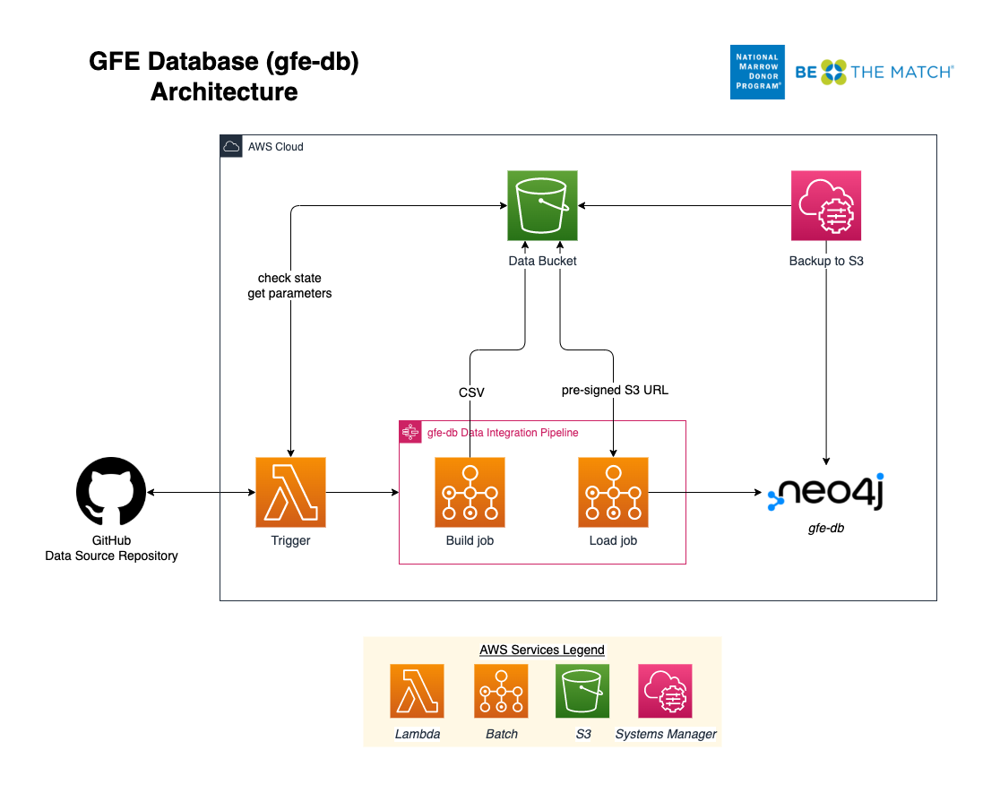

gfe-db
======

Graph database representing IPD-IMGT/HLA sequence data as GFE.

<!-- Need to update image -->
<!--  -->

## Table of Contents
- [gfe-db](#gfe-db)
  - [Table of Contents](#table-of-contents)
  - [Project Structure](#project-structure)
  - [Description](#description)
  - [Architecture](#architecture)
  - [Services](#services)
    - [Infrastructure](#infrastructure)
    - [Database](#database)
    - [Pipeline](#pipeline)
  - [Installation](#installation)
    - [Prerequisites](#prerequisites)
    - [Quick Start](#quick-start)
    - [AWS Configuration](#aws-configuration)
    - [Environment Variables](#environment-variables)
  - [Deployment to AWS](#deployment-to-aws)
  - [Configuration](#configuration)
    - [Neo4j Configuration](#neo4j-configuration)
    - [Pipeline Input Parameters](#pipeline-input-parameters)
    - [Application State](#application-state)
    - [Deploy Configuration](#deploy-configuration)
    - [Running the Pipeline](#running-the-pipeline)
    - [Clean Up](#clean-up)
  - [Local Development](#local-development)
    - [Creating a Python Virtual Environment](#creating-a-python-virtual-environment)
  - [Troubleshooting](#troubleshooting)
  - [Authors](#authors)
  - [References & Links](#references--links)

## Project Structure
```bash
.
├── LICENSE
├── Makefile                      # Use the root Makefile to deploy and delete infrastructure
├── README.md
└── gfe-db
    ├── database                  # Database service including backup
    │   ├── Makefile
    │   ├── neo4j
    │   │   └── neo4j.template    # Neo4j configuration
    │   ├── scripts               # Backup script
    │   └── template.yaml
    ├── infrastructure            # Infrastructure including VPC and subnets, S3 bucket, SSM Parameters and Secrets
    │   ├── Makefile
    │   └── template.yaml
    └── pipeline                  # Update pipeline including Batch jobs, StepFunctions, trigger
        ├── Makefile
        ├── config                # JSON files for storing app state
        ├── functions             # Lambda functions
        │   ├── Makefile
        │   └── trigger           # Pipeline trigger Lambda for new IMGT/HLA releases
        ├── jobs                  # AWS Batch jobs, triggered when a new IMGT/HLA version is released
        │   ├── Makefile
        │   ├── build
        │   └── load
        └── template.yaml
```

## Description
The `gfe-db` represents IPD-IMGT/HLA sequence data as GFE nodes and relationships in a Neo4j graph database. This application deploys and configures AWS resources for the GFE database and an automated data pipeline for updates.

## Architecture
<br>
<p align="center">
  
</p>

## Services
Resources are organized by service so that deployments can be decoupled using Makefiles. There are three main services within gfe-db: infrastructure, database and pipeline. Common configuration parameters are shared between resources using AWS SSM Paramter Store and Secrets Manager.

### Infrastructure
The infrastructure service deploys a VPC, public subnet, S3 bucket and common SSM parameters and secrets for the other services to use.

### Database
The database service deploys an EC2 instance running the Neo4j Community Edition AMI (Ubuntu 18.04) into a public subnet. Neo4j is ready to be accessed through a browser once the instance has booted sucessfully.

### Pipeline
The pipeline service automates integration of newly released data into the database using a scheduled Lambda. The trigger Lambda watches the source data repository and triggers the pipeline when it detects a new IMGT/HLA version is released. The pipeline uses a Step Functions state machine to orchestrate a Batch jobs including a build step which produces an intermediate set of CSV files, and a load step which deploys a long-running server that generates pre-signed S3 URLs for the CSVs and performs the loading using Cypher queries sent over HTTP. State for the pipeline is maintained using a JSON file stored in S3. Pipeline input parameters are also stored as a JSON in S3.

When loading the full dataset of 35,000+ alleles, the build step will generally take around 15 minutes, however the load step can take several hours.

## Installation
Follow the steps to set the deployment environment.

### Prerequisites
* Python 3.8
* GNU Make 3.81
* AWS CLI
* SAM CLI
* Docker
* jq
* coreutils

### Quick Start
1. Install prerequisites
2. [Set environment variables](#environment-variables)
3. Check the config JSONs (parameters and state) and edit the values as desired
4. Run `make deploy`
5. Invoke the trigger Lambda to start the pipeline using the current state
6. Query Neo4j

### AWS Configuration
Valid AWS credentials must be available to AWS CLI and SAM CLI. The easiest way to do this is running `aws configure`, or by adding them to `~/.aws/credentials` and exporting the `AWS_PROFILE` variable to the environment.

For more information visit the documentation page:
[Configuration and credential file settings](https://docs.aws.amazon.com/cli/latest/userguide/cli-configure-files.html)

### Environment Variables
These variables must be present in the shell environment before running Make. The best way to set these variables with with a `.env` file following these steps.

1. Create a `.env` file in the project root and add the values.
```bash
STAGE=<dev or prod>
APP_NAME=gfe-db
REGION=<AWS region>
NEO4J_USERNAME=<secret>
NEO4J_PASSWORD=<secret>
GITHUB_PERSONAL_ACCESS_TOKEN=<secret>
```

2. Source the variables to the environment.
```bash
set -a
source .env
set +a

# Check that the variables were set
env
```
*Important:* *Always use a `.env` file or AWS SSM Parameter Store or Secrets Manager for sensitive variables like credentials and API keys. Never hard-code them, including when developing. AWS will quarantine an account if any credentials get accidentally exposed and this will cause problems. Make sure to update `.gitignore`.

## Deployment to AWS
Once an AWS profile is configured and environment variables are exported, the application can be deployed using `make`.
```bash
make deploy
```
It is also possible to deploy or update individual services.
```bash
# Deploy/update only the infrastructure service
make deploy.infrastructure

# Deploy/update only the database service
make deploy.database

# Deploy/update only the pipeline service
make deploy.pipeline
```
Note: It is recommended to only deploy from the project root. This is because common parameters are passed from the root Makefile to nested Makefiles. If a stack has not been changed, the deployment script will continue until it reaches a stack with changes and deploy that.

## Configuration
Initial parameters and state for `gfe-db` are maintained using JSON files stored in the S3 (`DATA_BUCKET_NAME`) under the `config/` prefix.

### Neo4j Configuration
Custom configuration settings for Neo4j are contained in `neo4j.template`. This file is copied into `/etc/neo4j` during boot or manually. When Neo4j is restarted it will use the settings in `neo4j.template` to overwrite `neo4j.conf`. More information can be found in the documentation here: [Neo4j Cloud Virtual Machines] (https://neo4j.com/developer/neo4j-cloud-vms/)

### Pipeline Input Parameters
This file contains the base input parameters (excluding the `RELEASE` value) that are passed to the Step Functions State Machine and determine it's output. The `RELEASE` value is appended at runtime by the trigger Lambda. 
```json
// pipeline-input.json
{
  "ALIGN": "False",
  "KIR": "False",
  "MEM_PROFILE": "False",
  "LIMIT": "",
  "RELEASES": 3460
}

```
| Variable       | Example Value                    | Type             | Description                                                                                                               |
|----------------|----------------------------------|------------------|---------------------------------------------------------------------------------------------------------------------------|
| LIMIT          | 100                              | string           | Number of alleles to build. Leave blank ("") to build all alleles.                                                        |
| ALIGN          | False                            | string           | Include or exclude alignments in the build                                                                                |
| KIR            | False                            | string           | Include or exclude KIR dataalignments in the build                                                                        |
| MEM_PROFILE    | False                            | string           | Enable memory profiling (for catching memory leaks during build)                                                          |

### Application State
Application state tracks which releases have been processed and added to the database. This file tracks the releases which have already been processed. If the trigger detects a valid release branch in the source data repository that is not in the `releases` array, it will start the pipeline for this release. Once the update is finished, the processed release is appended to the array.
```json
// IMGTHLA-repository-state.json
{
  "timestamp": "2021-12-09 02:36:59",
  "repository_url": "https://github.com/ANHIG/IMGTHLA",
  "releases": [
    "3100",
    ...,
    "3450"
  ]
}
```

| Variable       | Example Value                    | Type             | Description                                                                                                               |
|----------------|----------------------------------|------------------|---------------------------------------------------------------------------------------------------------------------------|
| repository_url | https://github.com/ANHIG/IMGTHLA | string           | The repository the trigger is watching                                                                                    |
| releases       | ["3100", ..., "3450"]            | array of strings | List of available releases. Any release added to the repository that is not in this list will trigger the pipeline build. |

### Deploy Configuration
To deploy updates to state and/or pipeline input parameters, run the command.
```bash
make deploy.config
```

### Running the Pipeline
The update pipeline downloads raw data from [ANHIG/IMGTHLA](https://github.com/ANHIG/IMGTHLA) GitHub repository, builds a set of intermediate CSV files and loads these into Neo4j. To run the pipeline, navigate to the `gfe-db-trigger` function in the AWS Lambda console, select the **Test** tab, then click "Test". Because the function is run on a schedule it is not necessary to specify an event. The function will return an object like the following, depending on how many releases were passed to the input:
```json
// Trigger Lambda function return object
{
  "status": 200,
  "message": "Pipeline triggered",
  "input": [
    {
      "ALIGN": "False",
      "KIR": "False",
      "MEM_PROFILE": "False",
      "LIMIT": "",
      "RELEASES": "3460"
    },
    ...
  ]
}
```
### Clean Up
To tear down resources run the command.
```bash
make delete
```
Use the following commands to tear down individual services.
```bash
# Delete only the infrastructure service. Note that S3 data must be deleted manually or this will fail.
make delete.infrastructure

# Delete only the database service
make delete.database

# Delete only the pipeline service
make delete.pipeline
```

## Local Development

### Creating a Python Virtual Environment
When developing locally, you will need to create an individual virtual environment to run scripts in the `jobs` or `functions` directories, since they require different dependencies.
```bash
cd <specific job or function directory>
python3 -m venv .venv
source .venv/bin/activate
pip install -U pip
pip install -r requirements.txt
```

To use the virtual environment inside a Jupyter Notebook, first activate the virtual environment, then create a kernel for it.
```bash
# Install ipykernal
pip install ipykernel python-dotenv

# Add the kernel
python3 -m ipykernel install --user --name=<environment name>

# Remove the kernel
jupyter kernelspec uninstall <environment name>
```

<!-- ### Docker
Build the Docker image as defined in the Dockerfile.
```bash
cd <directory>
docker build --tag gfe-db .
```
Run the container to start Docker. Specify volumes, ports, or environment variables if necessary.
```
# Run Neo4j Docker
docker run -d --name gfe-db \
  -v "$(pwd)"/../data/csv/:/var/lib/neo4j/import \
  -v "$(pwd)"/../neo4j/plugins:/var/lib/neo4j/plugins \
  -v "$(pwd)"/../neo4j/logs:/var/lib/neo4j/logs \
  -p 7474:7474 -p 7473:7473 \
  -p 7687:7687 gfe-db
```
Access the container logs during startup to check the status of Neo4j.
```bash
docker logs -f gfe-db
```
Stop and restart as needed.
```bash
# Stop container
docker stop gfe-db

# Start container
docker start gfe-db

# Access the container's shell
docker exec -it <container> bash
``` -->

<!-- ### Build GFE dataset
Run the command to build the container for the build service.
```
# Build and run Docker locally
cd build
docker build --tag gfe-db-build-service .
```
Run the command to start the build. (Requires an S3 bucket)
```
docker run \
  --rm \
  -v "$(pwd)"/../data:/opt/data \
  -v "$(pwd)"/logs:/opt/app/logs \
  -e GFE_BUCKET='<S3 bucket name>' \
  -e RELEASES='3440' \
  -e ALIGN='False' \
  -e KIR='False' \
  -e MEM_PROFILE='True' \
  -e LIMIT='100' \
  --name gfe-db-build-service \
  gfe-db-build-service:latest
``` 
```
# Load from Docker locally
cd load
docker build -t gfe-db-load-service .
docker run gfe-db-load-service:latest
```

### Load the dataset into Neo4j
Once the container is running, the Neo4j server is up, and the dataset has been created, run the command to load it into Neo4j.
```
bash bin/load_db.sh
``` -->

<!-- ### Running the GFE database in Neo4j 4.2 using Docker
This README outlines the steps for building and running a development version of `gfe-db` in a local Docker container. Docker will deploy an instance of Neo4j 4.2 including the [APOC](https://neo4j.com/labs/apoc/4.1/) and [Graph Data Science](https://neo4j.com/docs/graph-data-science/current/) plugins. GFE data is stored in the `data/csv/` directory which is mounted as an external volume within the container when run. This keeps the data outside the container so that it can be updated easily. -->


<!-- ### `1.0-load-gfe-db`
Python notebook for developing the load service using the Neo4j HTTP API, Requests and Boto3 libraries.

### `1.0-refactor-gfedb_utils`
Development notebook for refactoring `gfe-db` and the `build/src/build_gfedb.py` module used for building the CSV datasets. -->

<!-- ## Running Tests -->

<!-- ## Configuring Neo4j in Dockerfile
Configuration settings for Neo4j are passed through environment variables in the Dockerfile.

### Username & Password
The username and password is set as follows:
```Dockerfile
# Dockerfile
ENV NEO4J_AUTH=neo4j/gfedb
```

### Memory Management
Optimal memory for Neo4j depends on available RAM. Loading and querying a larger dataset will require more memory allocated. Make sure that the Docker daemon is configured to handle whatever values are given here. For more information on memory management in Neo4j, see the [Neo4j Operations Manual](https://neo4j.com/docs/operations-manual/current/performance/memory-configuration/).
```Dockerfile
# Dockerfile; Rebuild the image after updating these
ENV NEO4J_dbms_memory_heap_initial__size=2G
ENV NEO4J_dbms_memory_heap_max__size=2G
``` -->

<!-- ## Deployment
`gfe-db` is deployed using Docker to an EC2 instance. Automated builds and loading of `gfe-db` on AWS is orchestrated using AWS Batch and StepFunctions. The infrastructure is defined using CloudFormation templates.

1. Make sure to update your AWS credentials in `~/.aws/credentials`.
2. Deploy the CloudFormation stacks and set the default region to `us-east-1` (there are issues with S3 pre-signed URLs in the other regions).
   ```bash
   cd gfe-db
   bash deploy.sh
   ```
3. In the AWS ECR console, follow the instructions in each ECR repo to build, tag and push the images to that repo.
4. In the Neo4j browser, run the `load/cypher/create_index.cyp` script.
5. Trigger an update using StepFunctions by starting an execution with the following input:
   ```json
   {
     "params": {
       "environment": {
         "RELEASES": "3450",
         "ALIGN": "False",
         "KIR": "False",
         "MEM_PROFILE": "False",
         "LIMIT": ""
       }
     }
   }
   ```
  Update the parameters to whatever is desired. Leaving `LIMIT` blank will build the entire GFE dataset (~30,000 alleles).
6. Get the `Neo4jDatabaseEndpoint` parameter from the `database-stack.yml` and load it in the browser on port 7474:
   ```bash
   # Example
   18.215.230.187:7474
   ```
   The graph should be loaded once the StepFunctions completes.


## Clean Up
To delete a stack and it's resources, use the CloudFormation console or run the command. S3 buckets and ECR repositories must be empty before they can be deleted.
```bash
aws cloudformation wait stack-delete-complete --stack-name <stack name>
``` -->

<!-- ### Local Clean-up
Delete the Docker container.
```bash
docker stop gfe
docker rm gfe
```
Delete the Docker image.
```bash
# List the images and get the IMAGE IDs for gfe-db and neo4j
docker image ls

# Remove the images for gfe-db:latest and neo4j:4.2 by the IMAGE ID
docker image rm <IMAGE ID> <IMAGE ID>
```
To delete the Jupyter Notebook kernel, run the command.
```bash
jupyter kernelspec uninstall gfe-db
``` -->

## Troubleshooting
* Check your AWS credentials in `~/.aws/credentials`
* Check that the environment variables have been exported
* Check that Python 3.8 is being used

## Authors
**Primary Contact:** Gregory Lindsey ([@abk7777](https://github.com/abk7777))

## References & Links
 * [hub.docker.com/r/nmdpbioinformatics/service-gfe-submission](https://hub.docker.com/r/nmdpbioinformatics/service-gfe-submission)
 * [service-gfe-submission.readthedocs.io](https://service-gfe-submission.readthedocs.io/en/latest/index.html)
 * [github.com/nmdp-bioinformatics/service-feature](https://github.com/nmdp-bioinformatics/service-feature)
 * [github.com/nmdp-bioinformatics/HSA](https://github.com/nmdp-bioinformatics/HSA)
 * [bioinformatics.bethematchclinical.org](https://bioinformatics.bethematchclinical.org)
 * [feature.nmdp-bioinformatics.org](https://feature.nmdp-bioinformatics.org)
 * [gfe.b12x.org](http://gfe.b12x.org)
 * [Neo4j Cloud Virtual Machines](https://neo4j.com/developer/neo4j-cloud-vms/)

-----------------
<br>
<p align="center">
  
</p>